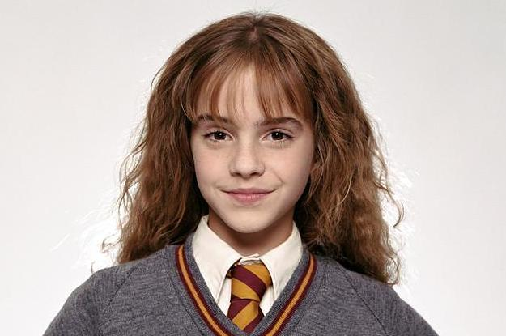

# Face swap con capa de invisibilidad
Este proyecto tiene como objetivo final usar nuestra propia webcam para realizar un Face Swap (reemplazo de cara) a la vez que podremos usar una “capa de la invisibilidad”.

El trabajo está dividido en dos códigos principales. En primer lugar, se ha querido imitar la capa de la invisibilidad que aparece en las películas de Harry Potter. Utilizando una manta de un determinado color, se conseguirá que desaparezca todo lo que tape. En segundo lugar, se ha querido dar un paso más, pudiendo convertirnos en uno de los personajes de la famosa saga mediante la implementación de un algoritmo de reemplazamiento facial. Se explicará paso a paso la realización del algoritmo, primero se realizará con dos fotos y finalmente se trasladará a la webcam.

## Estructura de archivos
En la carpeta `faces` se incluyen las diferentes caras a probar. En la carpeta `src` se encuentra el código explicado y comentado. En dicha carpeta hay dos jupyter notebooks, una para la capa y una para el Faceswap, con explicaciones y outputs de cada código. Del mismo modo hay un `main.py` con el ejecutable en python, también comentado.

_______________
## Ejemplo de Face Swap:

Harry Potter               |  Hermione Granger         |Harrmione Pottger  |
:-------------------------:|:-------------------------:|:-----------|
  |  |     

__________________
## Resultado final de Face Swap + capa de la invisibilidad:

